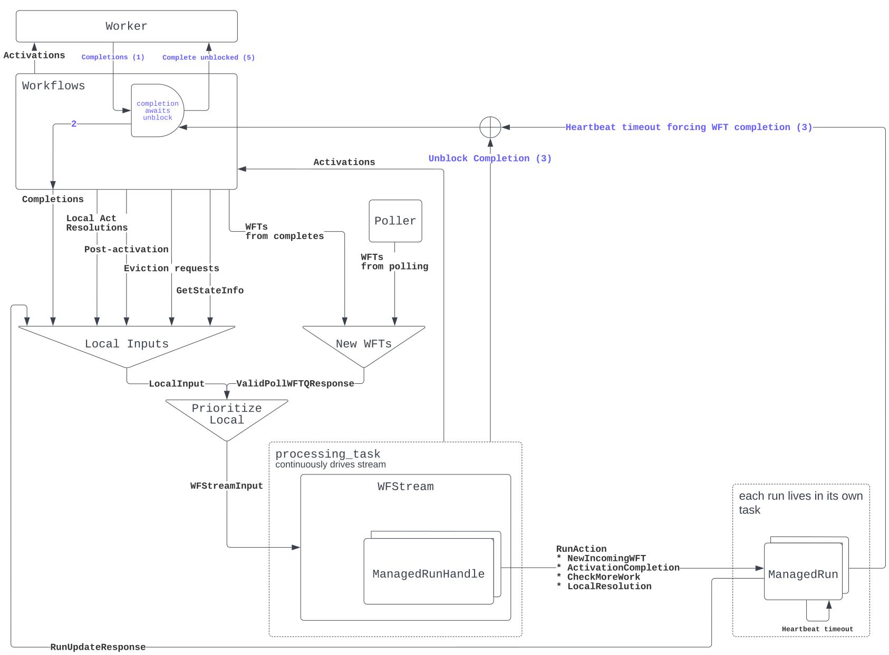

Core SDK Architecture
===

## High level description

The below diagram depicts how future SDKs are split into two parts. The `sdk-core` common code, which is written in Rust, and a `sdk-lang` package specific to the language the user is writing their workflow/activity in. For example a user writing workflows in Rust would be pulling in (at least) two crates - `temporal-sdk-core` and `temporal-sdk-rust`.


The `core` communicates with the Temporal service in the same way that existing SDKs today do, via gRPC. It's responsible for polling for tasks, processing those tasks according to our state machine logic, and then driving the language-specific code and shuttling events to it and commands back.

The `sdk-lang` side communicates with `sdk-core` via either C bindings, IPC, or (later) bindings to a WASM interface. Many languages already have nice support for calling into Rust code - generally speaking these implementations are using C bindings under the hood. For example, we use [neon](https://neon-bindings.com/) to support the TS/JS sdk, and we will likely use [PyO3](https://github.com/PyO3/pyo3) for Python. It is expected that such usages will layer another crate on top of `core` which brings in these language specific libraries to expose `core` to that language in an ergonomic manner. IPC will exist as a thin layer on top of the C bindings. Care should be taken here to avoid unnecessary copying and [de]serialization. Then `sdk-lang` is responsible for dispatching tasks to the appropriate user code (to whatever extent parts of this can be reasonably put in the core code, we desire that to make lang-specific SDKs as small as possible).

As a general note, the more we can push from `sdk-lang` into `sdk-core`, the easier our ecosystem is to maintain in the long run as we will have less semantically identical code.

### Glossary of terms

There are many concepts involved in the chain of communication from server->core->lang that all roughly mean "Do something". Unfortunately this leads to quite a lot of overloaded terminology in the code. This list should help to disambiguate:

* `HistoryEvent` (often referred to simply as an `Event`): These events come from the server and represent the history of the workflow. They are defined in the protobuf definitions for the Temporal service itself.
* `Command`: These are the commands defined in the temporal service protobufs that are returned by clients upon completing a `WorkflowTask`. For example, starting a timer or an activity.
* `WorkflowTask`: These are how the server represents the need to run user workflow code (or the result of it executing). See the `HistoryEvent` proto definition for more.
* `WorkflowActivation`: These are produced by the Core SDK when the lang sdk needs to "activate" the user's workflow code, either running it from the beginning or resuming a cached workflow.
* `WorkflowActivationJob` (shorthand: `Job`s): These are included in `WorkflowActivation`s and represent the actual things that have happened since the last time the workflow was activated (if ever). EX: Firing a timer, proceeding with the result of an activity, etc. They are typically derived from `HistoryEvent`s, but also include things like evicting a run from the cache.
* `WorkflowActivationCompletion`: Provided by the lang side when completing an activation. The (successful) completion contains one or more `WorkflowCommand`s, which are often translated into `Command`s as defined in the Temporal service protobufs, but also include things like query responses.

Additional clarifications that are internal to Core:
* `StateMachine`s also handle events and produce commands, which often map directly to the above `HistoryEvent`s and `Command`s, but are distinct types. The state machine library is Temporal agnostic - but all interactions with the machines pass through a `TemporalStateMachine` trait, which accepts `HistoryEvent`s, and produces `WorkflowTrigger`s.
* `WorkflowTrigger`: These allow the state machines to trigger things to happen to the workflow. Including pushing new `WfActivationJob`s, or otherwise advancing workflow state.


### Core SDK Responsibilities

- Communication with Temporal service using a generated gRPC client, which is wrapped with somewhat more ergonomic traits.
- Provide interface for language-specific SDK to drive event loop and handle returned commands. The lang sdk will continuously call/poll the core SDK to receive new tasks, which either represent workflows being started or awoken (`WorkflowActivation`) or activities to execute (`ActivityTask`). It will then call its workflow/activity functions with the provided information as appropriate, and will then push completed tasks back into the core SDK.
- Advance state machines and report back to the temporal server as appropriate when handling events and commands

### Language Specific SDK Responsibilities

- Periodically poll Core SDK for tasks
- Call workflow and activity functions as appropriate, using information in events it received from Core SDK
- Return results of workflows/activities to Core SDK
- Manage concurrency using language appropriate primitives. For example, it is up to the language side to decide how frequently to poll, and whether or not to execute worklows and activities in separate threads or coroutines, etc.

### Example Sequence Diagrams

Here we consider what the sequence of API calls would look like for a simple workflow executing a happy path. The hello-world workflow & activity in imaginary Rust (don't pay too much attention to the specifics, just an example) is below. It is meant to be like our most basic hello world samples.

```rust
#[workflow]
async fn hello_world_workflow(name: &str) -> Result<String, Error> {
    info!("Hello world workflow started! Name: {}", name);
    // Very much TBD how this would actually work in rust sdk. Many options here.
    activity!(hello_activity(name), timeout: 2s).await
}

#[activity]
async fn hello_activity(name: &str) -> String {
    format!("Hello {}!", name)
}
```

[](https://mermaid-js.github.io/mermaid-live-editor/edit#pako:eNptk81O6zAQhV9l5AWr8gIRqoQCC0QXQJDuJpvBnrZWbY-vf9rbi3h3bJqE0JKVlfP5zMyx_S4kKxKNiPQ3k5N0p3ET0PYOyucxJC21R5egA4zwStZzQAMdhb2WdIm1FWs5EHR3j5fyqsordJuTfAJWcL1cQtvAg9NJo9H_CQ4cdhTmetfAJnjZQJeK4Z-irw0f7v-RzEmzG80Ms__aXVVIGHfgA0uKUbvNCWl_-j2xMaPda-GfM-Vhsg6uh9aqEOEKtjomDseizb0KcOu9OU5yYogJE4FFudWO4ometUh7KnnU5VkItR1YcwCUSe-xzhanWpVZNTC2ezshc5MCvGQ3hbCoAahcIgDJ1qJTcaKHmpd-LVtvqK5u3sJSskuoXUnwzOJ7fLXHcn1-nZqcGk_nLPoXip6dmqc_FCZ1sXdKqNvmpPhQfouFsBQsalWu8HvFepG2ZKkXTVkqDLte9O6jcNmr0tm90uV8RLNGE2khMCfujk6KJoVMIzS8gYH6-ASOZQf0)

## API Definition

We define the interface between the core and lang SDKs in terms of gRPC service definitions. The actual implementations of this "service" are not generated by gRPC generators, but the messages themselves are, and make it easier to hit the ground running in new languages.

See the latest API definition [here](https://github.com/temporalio/sdk-core/tree/master/sdk-core-protos/protos/local/temporal/sdk/core)


## Other topics
- [Sticky task queues](arch_docs/sticky_queues.md)

## Workflow Processing Internals

