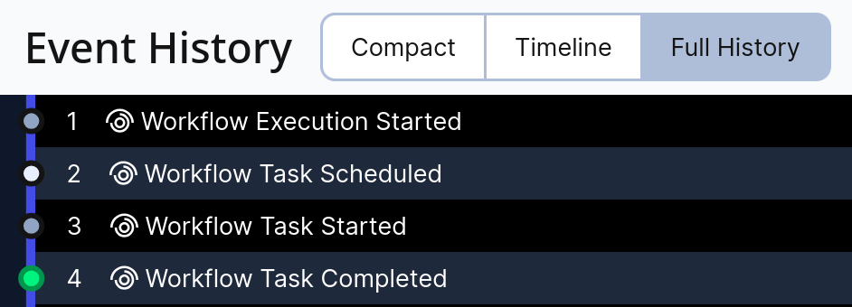
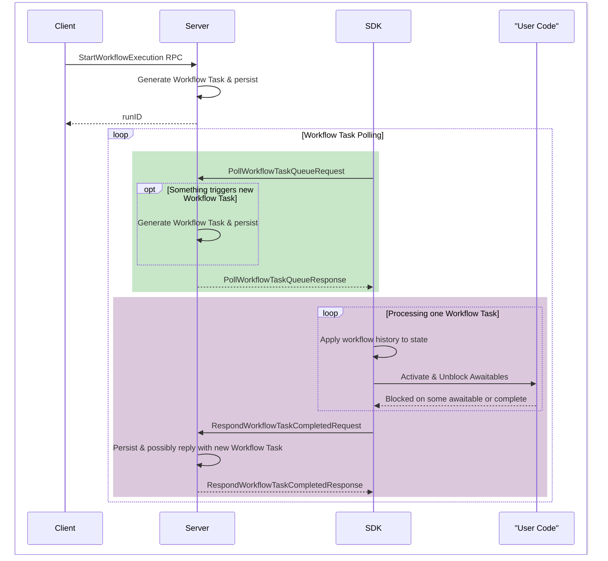

# Intro to Temporal SDKs

This document is primarily meant as an onboarding guide for new Temporal SDK developers, to be
accompanied by a live presentation. Hence, content does not have maximal context. If reading this
independently, you will also want to refer to our documentation [site](https://docs.temporal.io).

## Primary SDK Concepts

See also our
[official docs on basic concepts](https://docs.temporal.io/evaluate/understanding-temporal).

### Workflows

Workflows are durable programs. Their state is materialized from event history and they can be
replayed zero or more times. Workflow code must be deterministic and must use SDK Workflow-specific
APIs. Side effects and non-deterministic APIs should be placed in Activities.

**Example Workflow Code (Python):**

```python
from datetime import timedelta
from temporalio import workflow

@workflow.defn
class SayHello:
    @workflow.run
    async def run(self, name: str) -> str:
        return await workflow.execute_activity(
            say_hello, name, schedule_to_close_timeout=timedelta(seconds=5)
        )
```

### Activities

Activities are invoked from a Workflow and can run arbitrary code. They can be retried, are subject
to timeouts, and should be idempotent/reentrant. Activities can be short or long-running and can
heartbeat.

**Example Activity Code (Python):**

```python
from temporalio import activity

@activity.defn
async def say_hello(name: str) -> str:
    return f"Hello, {name}!"
```

### Clients

Clients serve as a driver for interaction with the Temporal server. They provide a high-level API
for a subset of gRPC calls, including Workflow "CRUD" operations, Activity completion, and
Schedules.

**Example Client Code (Python):**

``` python
from temporalio.client import Client

# Import the workflow from the previous code
from .workflows import SayHello

async def main():
    client = await Client.connect("localhost:7233")

    result = await client.execute_workflow(
        SayHello.run, "my name", id="my-workflow-id", task_queue="my-task-queue")

    print(f"Result: {result}")
```

### Workers

Workers are stateless entities that poll the server for Workflow, Activity, and Nexus tasks. They
run user-defined Workflows, Activities, and Nexus Operations, manage concurrency and rate limits,
and provide the language runtime for workflows.

**Example Worker Code (Python):**

``` python
from temporalio.client import Client
from temporalio.worker import Worker

from .activities import say_hello
from .workflows import SayHello

async def main():
    client = await Client.connect("localhost:7233")

    worker = Worker(
        client,
        task_queue="my-task-queue",
        workflows=[SayHello],
        activities=[say_hello])
    await worker.run()
```

## SDK \<-\> Server Interaction

### Event History and it's construction

Event history is a record of all events that have occurred in a Workflow. Workflow tasks are the
fundamental unit of progress for Workflows. Any time your Workflow code makes progress, it does so
because your worker processed one of these Workflow tasks. Workflow tasks contain some or all of the
Workflow’s history, along with possibly queries and other bits of information the worker might care
about.

The first few events in a workflow's history always look like this:



The first Workflow task for a Workflow always includes the initial events. When the SDK receives a
task, it processes the history, runs your Workflow code, and eventually responds with commands to
the server. Commands are actions like "start a timer" or "run an Activity."

A sequence diagram of this process is shown below. Not everything may make sense yet, but we can
refer back to this diagram during later explanations.



**How History is Constructed:**

Workflow tasks contain history and are responded to with commands. Every command is turned into a
corresponding event (referred to as "dual" or "command-events"). The Temporal server takes action on
received commands, and the consequences of those actions also become events (e.g., `TimerFired`,
`ActivityTaskCompleted`). When events that trigger a new Workflow task occur, the Temporal server
generates a new Workflow task because a worker needs to run the Workflow code to process this new
information.

This cycle continues until the Workflow is complete: new Workflow Tasks are created, processed by
the SDK, responded to with commands, until a new Workflow task begins, and so on.

We will use the following example Workflow to illustrate this process:

```python
@activity.defn
async def say_hello(name: str) -> str:
    return f"Hello, {name}!"

@workflow.defn
class ReplayExampleWorkflow:
    @workflow.run
    async def run(self, name: str) -> str:
        my_hello = workflow.execute_activity(
            say_hello, name, schedule_to_close_timeout=timedelta(seconds=5)
        )
        timer = workflow.sleep(10)
        (activity_result, _) = await asyncio.gather(my_hello, timer)
        return activity_result
```

**Example Workflow History Analysis:**

1. The initial Workflow task is processed. The `execute_activity` call creates a command for
   scheduling an Activity, and `workflow.sleep` creates a command for a timer.
2. The `asyncio.gather` line indicates a wait for both the activity and timer to resolve.
3. The SDK knows when to respond to the task because the Workflow cannot make any more progress. All
   buffered commands are sent to the server (activity and timer commands, in that order). This
   completes the first Workflow task.
4. The server receives these commands, which are converted into `ActivityTaskScheduled` and
   `TimerStarted` events (duals of the commands).
5. When the Activity completes, an `ActivityTaskCompleted` event is added to the history. This
   triggers a new Workflow task.
6. The worker processes this new task, and the future `my_hello` is resolved. The Workflow code,
   however, is still blocked on `gather` because the timer hasn't fired. The SDK replies with an
   empty list of commands, indicating no new actions.
7. The timer fires, resulting in a `TimerFired` event. This generates another Workflow task.
8. When this task is processed, the `gather` call resolves. The Workflow function returns, producing
   a `CompleteWorkflowExecution` command.
9. This command is converted into a `WorkflowExecutionCompleted` event, and the Workflow finishes.

The complete history at the end of all this is the following:

1. Workflow Execution Started
2. Workflow Task Scheduled
3. Workflow Task Started
4. Workflow Task Completed
5. Activity Task Scheduled `say_hello`
6. Timer Started `1 (1s)`
7. Activity Task Started `say_hello`
8. Activity Task Completed `say_hello`
9. Workflow Task Scheduled
10. Workflow Task Started
11. Workflow Task Completed `Notice: No commands sent`
12. Timer Fired `1 (1s)`
13. Workflow Task Scheduled
14. Workflow Task Started
15. Workflow Task Completed
16. Workflow Execution Completed

This repetitive nature of processing Workflow tasks, where the SDK polls for tasks, processes
history, unblocks user code, and sends new commands, continues until Workflow completion.

### How Replay Works

Above we described the sequence of events as if the Python objects remained in memory between
workflow tasks, with asyncio futures "waiting" to be resolved. That is indeed typically the case,
but technically it's a performance optimization (we refer to it as the "sticky" optimization), where
history is delivered in incremental pieces rather than in its entirety. When a worker doesn't have
the workflow already in-cache, it "replays" the workflow code from the beginning (this is why we
said workers are stateless), making use of the supplied history to deterministically reach precisely
the state it had reached previously.

Replay is fundamental to Temporal's durability and determinism, and so we'll now look at it in a bit
more detail.

**History Processing:**

SDKs process events from history serially, one at a time. Each event is fed to a specific instance
of a state machine. There is a type of state machine for every command, as well as some non-command
events/concepts. The state of a particular Workflow run consists of the combination of the states of
these state machines, and importantly, the order in which they are created.

**Timer State Machine in Core (Example):**

We can use the Timer state machine to illustrate how determinism is enforced:


When we first create the timer, we immediately schedule it, which produces the `StartTimer` command,
which becomes the `TimerStarted` event. The `Created` state isn’t really necessary here, but the
schedule transition serves as a convenient way to produce the start timer command.

When we see a `TimerStarted` event on history, we know that the command we issued exists in Workflow
history, and we move to the StartCommandRecorded state and wait to see what happens - it can either
fire or be canceled.

In our example, there’s a `TimerFired` event, so when the SDK processes that event, we’d take that
transition, and the machine ends up in the final fired state

At this point, you might be wondering - why does that `StartCommandRecorded` state matter? Why have
a transition for `TimerStarted` at all? We know we sent the command to the server, so why not just
wait to see if the timer fires or is canceled from the `StartCommandCreated` state? The answer is
that's a big part of the secret sauce for how we enforce determinism.

**Enforcing Determinism:**

A Workflow must always emit the same commands in the same sequence. Temporal can detect violations
of this rule because of the "dual" events that each command produces. The `TimerStarted` transition
ensures that when replaying a Workflow, the current code attempting to start a timer does so at the
same point and in the same way as what exists in history. The order in which state machines are
created by Workflow code also matters to ensure the same sequence of commands is produced. This
prevents scenarios where changed code might run a command that should have been mutually exclusive
with a command already in history.

**Example of Nondeterminism:**

If the order of arguments to `asyncio.gather` is swapped in the previous example Workflow, replaying
the Workflow will result in a nondeterminism error (often referred to as an "NDE"):

```
temporalio.workflow.NondeterminismError: Workflow activation completion failed: Failure { failure:
Some(Failure { message: "[TMPRL1100] Nondeterminism error: Timer machine does not handle this event:
HistoryEvent(id: 5, ActivityTaskScheduled)", source: "", stack_trace: "", encoded_attributes: None,
cause: None, failure_info: Some(ApplicationFailureInfo(ApplicationFailureInfo { r#type: "",
non_retryable: false, details: None, next_retry_delay: None })) }), force_cause:
NonDeterministicError }
```

This error occurs because the "dual" events in the history are not in the same order as the commands
produced by the modified Workflow code. The timer machine, expecting a `TimerStarted` event,
encounters an `ActivityTaskScheduled` event instead, leading to a nondeterminism error. In other
words, we did not produce the same commands in the same order. This mechanism ensures Workflow state
consistency.
